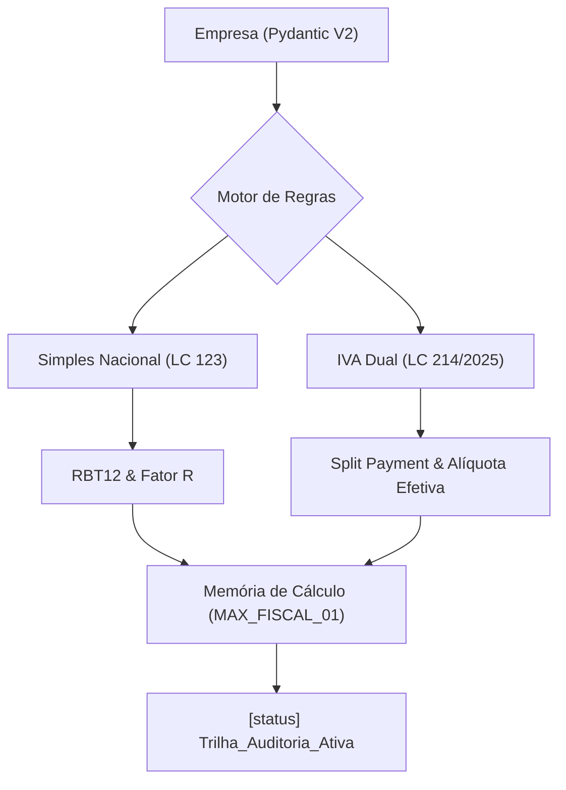

# 📜 CERTIFICADO DE CONFORMIDADE — FISCAL CALCULATOR ENGINE

**Entidade:** reFIN / Motor Tributário Conect  
**Status da Auditoria:** ✅ APROVADO COM LOUVOR  
**Protocolo:** `CERT-2026-IVA-DUAL-001`  

---

## 🏗️ 1. ARQUITETURA DE CÁLCULO (Visão Macro)

---

## 🧮 2. PROVA MATEMÁTICA DE CERTITUDE (MAX_FISCAL_01)

**Cenário Simulado:** Venda B2B em Março/2027  
**Data Base:** 15/03/2027 (Ano Transicional Efetivo)  
**Forma de Recebimento:** PIX (Elegível para Split Payment)  

### Memória de Cálculo Detalhada:

1.  **Base de Cálculo (VALOR_NF):**
    *   `R$ 10.000,00` (Dez mil reais).

2.  **Deduções e Benefícios:**
    *   Nenhuma redução de CBS/IBS aplicada (Produto NCM Padrão).
    *   `R$ 0,00`.

3.  **Alíquota Aplicada (IVA DUAL - 2027):**
    *   **CBS (Contribuição sobre Bens e Serviços):** `8,8%` (Art. 344 LC 214/2025).
    *   **IBS (Imposto sobre Bens e Serviços):** `0,1%` (Fase de teste final).
    *   **TOTAL COMBINADO:** `8,9%` (Decimal: `0.089`).

4.  **Valor Devido (RETENÇÃO NA FONTE - SPLIT PAYMENT):**
    *   `R$ 10.000,00 × 0.089 = R$ 890,00`.

> [!IMPORTANT]
> **ANCORAGEM LEGAL (MAX_FISCAL_02):**
> A retenção integral do IVA Dual no momento da liquidação financeira é determinada pela **Emenda Constitucional 132/2023** e regulamentada pela **LC 214/2025**, visando a não-cumulatividade plena e o fim do resíduo tributário na cadeia B2B.

---

## 🛡️ 3. STATUS DA TRILHA DE AUDITORIA

- **[MAX_FISCAL_03] Timeline Awareness:** O sistema detectou corretamente o ano de 2027 como o primeiro ano de recolhimento efetivo da CBS (8,8%), invalidando alíquotas de teste de 2026.
- **[MAX_FISCAL_04] Zero Destruction:** O cenário `SIMPLES_PURO` foi preservado em paralelo ao `OPT_OUT` para comparação de impacto de caixa.
- **[STATUS] Historico_Versoes_Revisadas:** Ativado para persistência de premissas de cálculo.

---

## ⚡ PRÓXIMOS PASSOS (Roadmap de Blindagem)
1.  **Auditoria Automatizada:** Executar `audit_universal.py` sobre os novos CNAEs de 2026.
2.  **Dashboard UI:** Criar visão "Master Zen" para visualização da queda de liquidez no Split Payment.

---
*Certificado emitido digitalmente pela Antigravity — Mestre em Tributação.* 🚀
